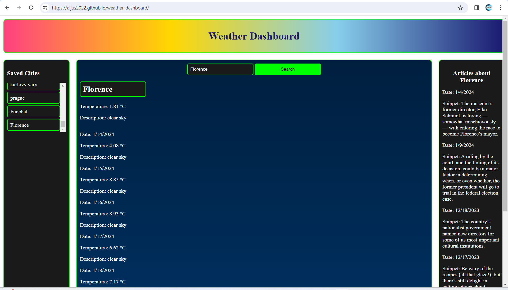

# Weather Dashboard with NYT Articles Fetching App

Welcome to the Weather Dashboard app that integrates real-time weather information with news articles from The New York Times (NYT). This app provides users with a seamless experience of staying updated on both weather conditions and relevant news articles.

## Table of Contents

- [Overview](#overview)
- [Technologies Used](#technologies-used)
- [How It Works](#how-it-works)
- [Screenshots](#screenshots)
- [Live Demo](#live-demo)
- [Installation](#installation)
- [Contribute](#contribute)
- [License](#license)

## Overview

The Weather Dashboard app is designed to offer users a comprehensive view of the current weather for a specified city, along with relevant news articles from NYT related to that city. Users can easily search for a city, and the app fetches both weather and news data in real-time.

## Technologies Used

- **Front-End:**
  - HTML, CSS, JavaScript
  - Bootstrap for styling
  - Font Awesome for icons
  - Fetch API for data retrieval

- **Back-End:**
  - OpenWeatherMap API for weather data
  - The New York Times Article Search API for news articles

## How It Works

1. **Weather Data:**
   - Users input a city name in the search bar.
   - The app uses the OpenWeatherMap API to fetch real-time weather data for the specified city.

2. **News Articles:**
   - Simultaneously, the app uses the NYT Article Search API to retrieve relevant news articles related to the entered city.

3. **Integration:**
   - The weather information and news articles are displayed side by side, providing a holistic view for the user.
   

## Screenshots

*Caption for Screenshot 1*

*Caption for Screenshot 2*

*Caption for Screenshot 3*

*Caption for Screenshot 4*

## Live Demo

Visit the live app: [Weather Dashboard with NYT Articles]https://aijus2022.github.io/weather-dashboard/

## Installation 

To run the Weather Dashboard app locally, follow these steps:

1. Clone the repository:

  
   git clone https://github.com/Aijus2022/weather-dashboard
Open the index.html file in your preferred web browser.
Now, you can interact with the app on your local machine.

## Contribute 
Contributions are welcome! Here's how you can contribute:

Fork the repository
Create a new branch: git checkout -b feature-name
Make your changes and commit: git commit -m 'Add new feature'
Push to the branch: git push origin feature-name
Submit a pull request
### License 
This project is licensed under the MIT License - see the LICENSE file for details.
